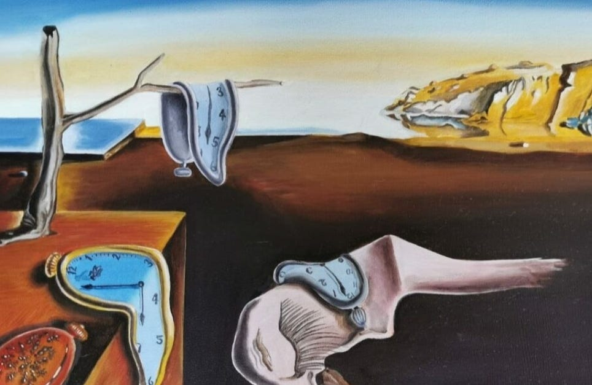
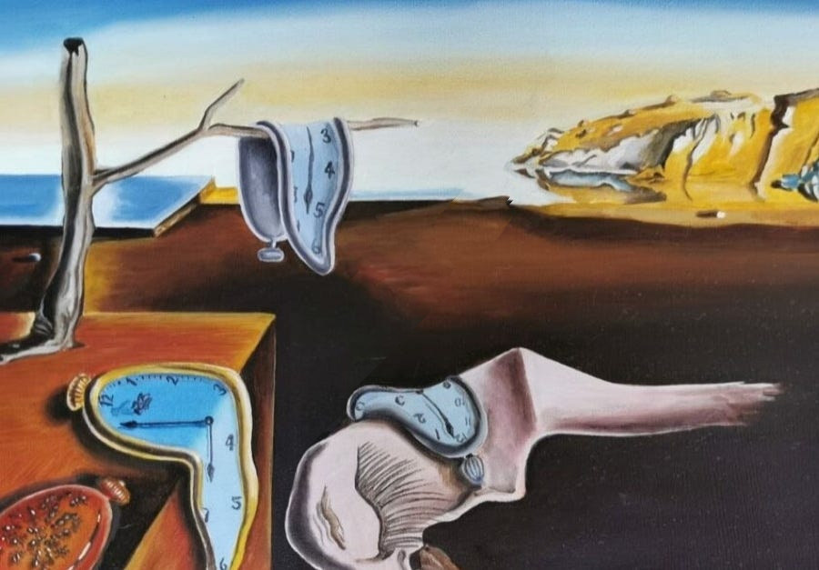

# Seam Carving – Content-Aware Image Resizing

This project implements **seam carving**, a content-aware image resizing algorithm that intelligently removes the least important pixels (seams) to reduce image width without distorting key visual content.

## ✨ Features
- Supports grayscale and RGB images.
- Computes **luminance**, **Gaussian blur**, and **Sobel gradients**.
- Builds a dynamic programming **energy map** to guide seam removal.
- Outputs each processing step (grayscale, blurred, gradient, energy map, resized result).
- Clean and modular C code with custom image processing library built on [`stb_image`](https://github.com/nothings/stb).

## 🖼️ Example Workflow
1. Convert image to luminance.
2. Apply Gaussian blur.
3. Apply Sobel filter to get edge intensity.
4. Build energy map using dynamic programming.
5. Iteratively remove vertical seams to reduce width.

<p align="center">
  
  ➜
  
</p>

## 📄 Based On
- Seam carving algorithm from the paper:  
  **"Seam Carving for Content-Aware Image Resizing"**  
  *Shai Avidan and Ariel Shamir, SIGGRAPH 2007*  
  [Read paper](https://perso.crans.org/frenoy/matlab2012/seamcarving.pdf)

## 🛠️ Build Instructions

### Requirements
- clang or compatible C compiler supporting 
- Make

### Build
```bash
make
```

### Run
```bash
./bin/main images/in.jpg
```

You'll be prompted to enter a target width (less than the original). Processed images will be saved in the `images/` directory.

## 📁 Project Structure
```
.
├── bin/           # Executable binary
├── build/         # Compiled object files
├── images/        # Input and output images
├── include/       # Image processing headers
│   └── stb/       # stb_image and stb_image_write
├── src/           # Source code
├── Makefile
├── README.md
└── LICENSE
```

## 📚 Future Improvements
- Horizontal seam removal (for height reduction).
- Masked region protection (e.g. faces).
- Interactive GUI to visualize seams.
- Benchmarking performance with large images.
